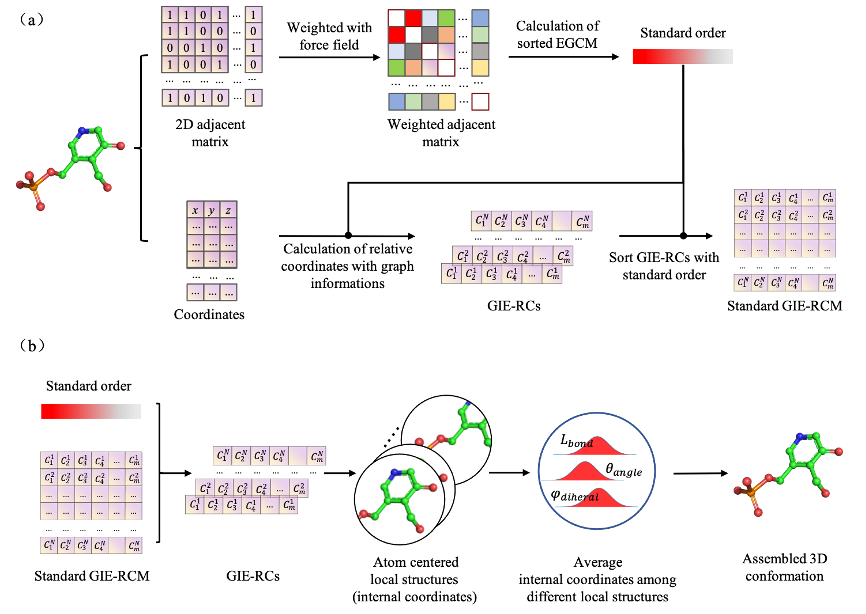
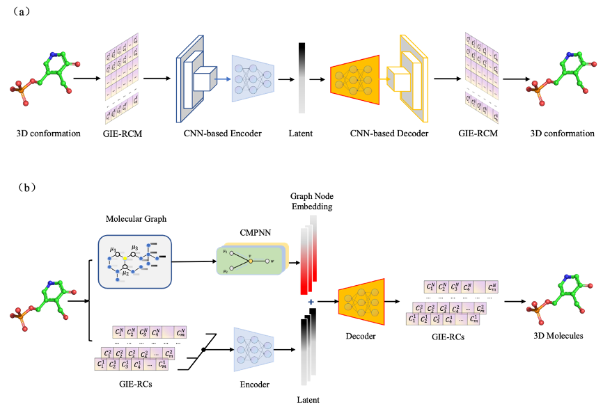

# Conformational generative Model based on GIERC （D3MG）
Here is a novel translation and rotation invariant three-dimensional conformation encoding methods, namely graph information embedded relative coordinate (GIE-RC), for small molecules as well as biopolymers. There are three important attributes of GIE-RC: (1) reversible lossless conversion with 3D coordinates; (2) less sensitive on errors of latent variables comparing with other 3D representation methods; (3) Convenience in turning a complex 3D generation task into a graph node feature generation problem. A 3D conformational generative model was then constructed by combining the GIE-RC representation with an autoencoder (AE) neural network, our results show that this model can be used for conformation generation of small molecule as well as large peptide structures. Additionally, this method can be applied as a useful data augmentation tool for improving the construction of neural network-based force field.

The workflow of GIE-RC as shown as follows:

the structure of Graph-NAE and CNN-NAE as follows

### Custom Dependencies

### File structure
- [D3MG-kit_for_Graph-NAE]: it is the source code for Graph-NAE model based on GIERC  
- [D3MG-kit_for_CNN-NAE]: it is the source code for CNN-NAE model based on GIERCM  
- [examples/example_for_Graph-NAE]: An example of training the Graph-NAE model on a multi-conformational dataset of ligand (ID: PLP)
- [examples/example_for_CNN-NAE]: An example of training the Graph-NAE model on a multi-conformational dataset of ligand (ID: PLP)

### Install:
- [CNN-NAE]: cd D3MG-kit_for_CNN-NAE & python setup.py install 
- [Graph-NAE]: cd D3MG-kit_for_Graph-NAE & python setup.py install 
